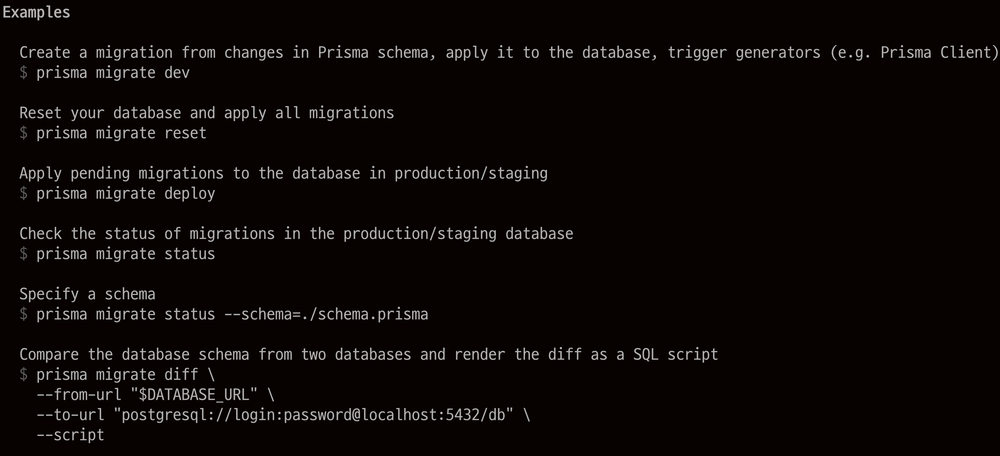
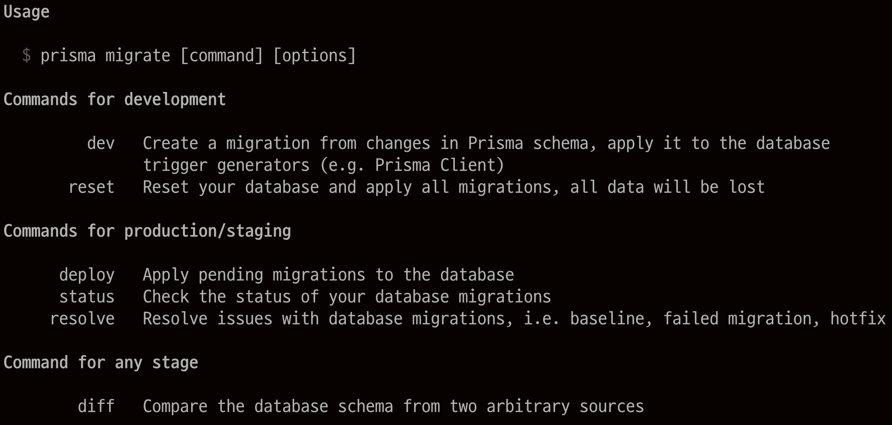
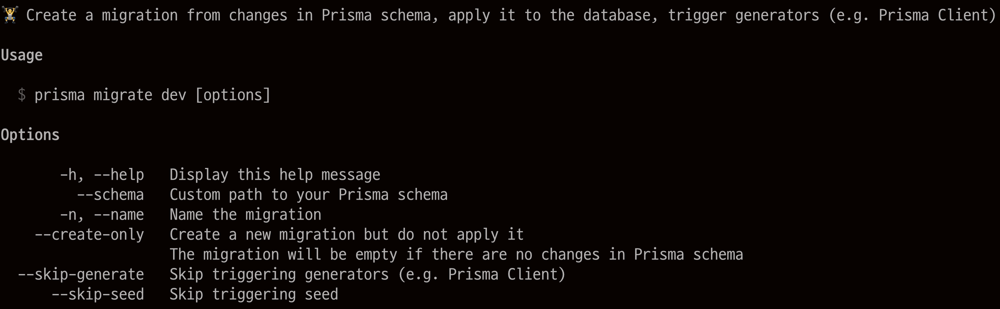
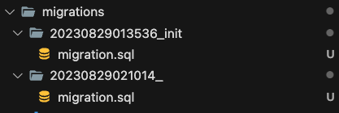
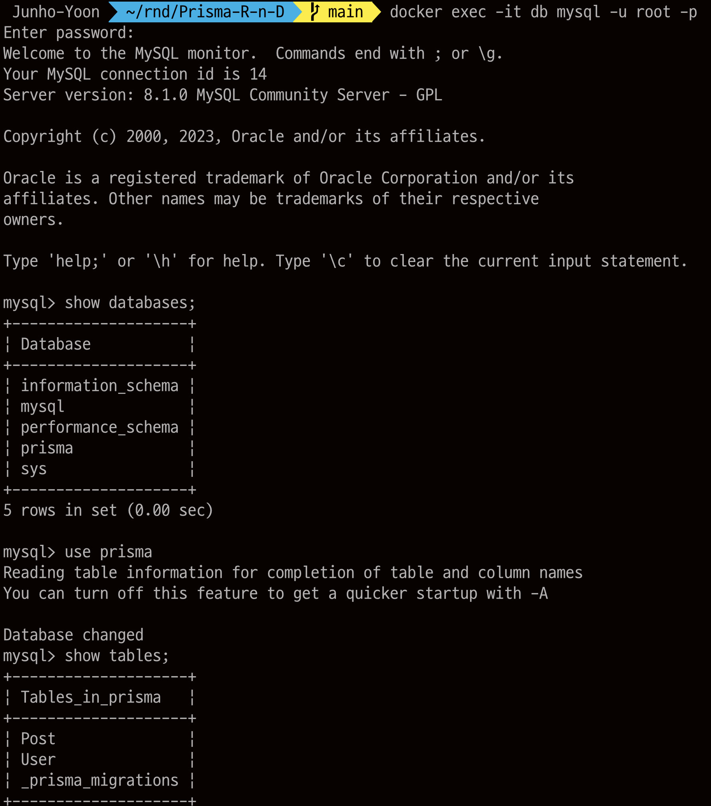
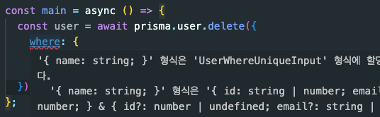

# Start Prisma with MySQL

## 1. 환경 세팅

1. TypeScript 패키지 설치
   ```bash
   yarn add -D typescript @types/node ts-node
   ```
2. TypeScript 환경 설정

   ```bash
   npx tsc --init
   ```

3. Prisma Dependency 설치

   ```bash
   yarn add -D prisma

   yarn add @prisma/client
   ```

4. MySQL Docker Container 실행

   ```bash
   docker run -d --name db -p 3306:3306 -e MYSQL_ROOT_PASSWORD=hoplin1234! -e MYSQL_ROOT_HOST=% -e MYSQL_DATABASE=prisma mysql
   ```

5. MySQL datasource로 하는 prisma 프로젝트 실행

   ```
   npx prisma init --datasource-provider mysql
   ```

## 2. 모델 정의

```prisma
// This is your Prisma schema file,
// learn more about it in the docs: https://pris.ly/d/prisma-schema

generator client {
  provider = "prisma-client-js"
}

datasource db {
  provider = "mysql"
  url      = env("DATABASE_URL")
}

model User{
  id    Int    @id @default(autoincrement())
  email String @unique
  name String?
  post Post[]
}

model Post{
  id Int @id @default(autoincrement())
  title String
  content String?
  published Boolean @default(true)
  author User @relation(fields: [authorId],references: [id])
  authorId Int
}
```

## 3. Prisma Schema Table로 변경하기, `npx prisma migrate`

현재 상태는 Prisma Schema 모델만 정의되어있을 뿐, 아직 데이터베이스에 실질적인 테이블은 존재하지 않는다. Schema를 데이터베이스 테이블로 만들어주기 위해서는 Prisma의 Migrate라는 개념이 사용된다.

```bash
npx prisma migrate (Command) (Option)
```

`prisma migrate`에는 command가 존재한다.

```
npx prisma migrate --help
```



우선 여기서는 `dev` command를 사용하여 generator를 실행한다. 우선 command의 권장사항을 보면, `dev` command는 개발시에 Schema 마이그레이션 할때만 사용하는것이 권장되며, `reset`을 통해 DB를 초기화할 수 있다.

Production 레벨에서는 `deploy` command를 통해 기존 마이그레이션을 Production DB에 적용할 수 있다.



각각의 command의 옵션 또한 존재한다. 우선 여기서는 `dev` command의 option을 살펴본다.

```
npx prisma migrate dev --help
```



위애서 생성한 Schema를 Table로 변경한다

```
npx prisma migrate dev --name init
```

위 명령어에서는 `name` 옵션을 옵션으로 주었는데, `name` 옵션을 주면 마이그레이션 폴더의 언더스코어 뒤에 `name`의 값이 붙게된다. 아래 사진에서 `name` 옵션을 주었을때 주지 않고 생략했을때(커맨드상에서 물어보지만, 공백으로 넘길때) 두가지 예시를 든다.



MySQL에 테이블이 잘 생성된것을 볼 수 있다.



## 4. TypeScript코드를 통해 Query하기 (`Get`,`Post`)

### Normal Create

[Code](../src/basic-create.ts)

이제 TypeScript 코드를 통해서 Query를 생성해본다.

```TypeScript
const prisma = new PrismaClient();

async function main() {
  const user = await prisma.user.create({
    data: {
      name: "hoplin",
      email: "jhoplin7259@gmail.com",
    },
  });
  console.log(user);
}

main()
  .then(async () => {
    await prisma.$disconnect();
  })
  .catch(async (err) => {
    console.error(err);
    await prisma.$disconnect();
    process.exit(1);
  });
```

`create`메소드를 사용하면, TypeORM과 마찬가지로 해당 Schema의 필드와 동일한 JSON Object를 반환한다.

```
npx ts-node basic-create.ts

// 결과
{ id: 1, email: 'jhoplin7259@gmail.com', name: 'hoplin' }
```

### Create with Relation

[Code](../src/create-user1.ts)

Prisma에서 `create`메소드 실행시, Relation에 있는 테이블의 레코드도 함께 생성할 수 있다.

```typescript
const prisma = new PrismaClient();

async function main() {
  const user = await prisma.user.create({
    data: {
      name: "hoplin2",
      email: "jhyoon0815103@gmail.com",
      post: {
        create: {
          title: "example-title",
          content: "example-content",
        },
      },
    },
  });
  console.log(user);
}

main()
  .then(async () => {
    await prisma.$disconnect();
  })
  .catch(async (err) => {
    console.error(err);
    await prisma.$disconnect();
  });
```

Relation을 가지는 필드에 `create`라는 프로퍼티를 추가하고, Relation에 해당하는 테이블 레코드값들을 넣어주면된다. 다만, 주의할 점은 Relation테이블의 레코드를 같이 생성해줘도 저장한 User 테이블의 값만 반환된다는 것이다.

```bash
npx ts-node create-user1.ts

// 결과
{ id: 2, email: 'jhyoon0815103@gmail.com', name: 'hoplin2' }
```

### Normal Find

[Code](../src/find-user.ts)

데이터를 조회하기 위해서는 `find*`메소드를 사용하면 된다. 가장 기본적으로 전체 데이터를 불러오기 위해서는 `findMany`메소드를 사용하면 된다.

```typescript
async function main() {
  const users = await prisma.user.findMany();
  console.log(users);
}

main()
  .then(async () => {
    await prisma.$disconnect();
  })
  .catch(async (err) => {
    console.error(err);
    await prisma.$disconnect();
  });
```

```
npx ts-node find-user.ts

// 결과
[
  { id: 1, email: 'jhoplin7259@gmail.com', name: 'hoplin' },
  { id: 2, email: 'jhyoon0815103@gmail.com', name: 'hoplin2' }
]
```

name이 `hoplin`인 필드는 연관관계를 맺고있는 테이블이 없지만 `hoplin2`인 필드는 연관관계 Post를 가지고 있다. 하지만 출력되지는 않는것을 볼 수 있다. 이는 `findMany`의 옵션에 `include`를 포함시켜주지 않았기 때문이다.

```typescript
async function main() {
  //   const users = await prisma.user.findMany();
  const users = await prisma.user.findMany({
    include: {
      post: true,
    },
  });
  console.log(users);
}
```

Post에 대해서도 동일하게 author를 불러오고 싶다면 `findMany`의 옵션에 `include`를 포함시켜주면 된다.

```typescript
const posts = await prisma.post.findMany({
  include: {
    author: true,
  },
});

//결과
[
  {
    id: 1,
    title: "example-title",
    content: "example-content",
    published: true,
    authorId: 2,
    author: { id: 2, email: "jhyoon0815103@gmail.com", name: "hoplin2" },
  },
];
```

`findMany`의 경우에는 `SelectSubset`이라는 타입의 option을 받는다.

```typescript
findMany<T extends PostFindManyArgs<ExtArgs>>(
args?: SelectSubset<T, PostFindManyArgs<ExtArgs>>
): Prisma.PrismaPromise<$Result.GetResult<Prisma.$PostPayload<ExtArgs>, T, 'findMany'>>
```

그리고 이 타입은 `SelectAndInclude`라는 타입을 최종적으로 따르게 된다.

```
type SelectAndInclude = {
    select: any
    include: any
  }
```

`SelectAndInclude`타입의 옵션들은 모두 반환값에 영향을 준다는 공통점이 있다.
`inclue`옵션의 경우에는 앞에서 봤듯이 연관관계에 있는 값들을 가져오게되며, `select`의 경우에는 어떤 필드의 값을 가져올것인지에 대한 여부이다.([Document](https://www.prisma.io/docs/reference/api-reference/prisma-client-reference#findmany) 참고)

## 5. TypeScript코드를 통해 Query하기 (`Update`,`Delete`)

### Normal Update

[Code](../src/update-user.ts)

앞에서 생성한 값을 [`update`](https://www.prisma.io/docs/reference/api-reference/prisma-client-reference#update)해본다. `update`메소드는 총 두개의 필수 매개변수가 존재한다

- where : 검색조건
- data : 변경할 데이터

```typescript
async function main() {
  const user = await prisma.user.update({
    where: { email: "jhyoon0815103@gmail.com" },
    data: { email: "andrewyoon10@naver.com" },
  });
  console.log(user);
}


// 결과
{ id: 2, email: 'andrewyoon10@naver.com', name: 'hoplin2' }
```

만약 업데이트하고자 하는 검색조건에 부합하지 않는 경우에는 `PrismaClientKnownRequestError`라는 예외를 반환하게 된다.

### Normal Upsert

TypeORM에도 있듯이 [`upsert`](https://www.prisma.io/docs/reference/api-reference/prisma-client-reference#upsert)라는 개념도 존재한다. `upsert`는 업데이트 하고자 하는 값을 찾은 뒤 있으면 update를, 없으면 insert를 진행하는 메소드이다. `upsert`는 세가지의 필수 옵션이 요구된다

- where : 검색조건
- update : update하고자 하는 값
- create : update불가능할 경우, 새로 생성할 데이터 객체

### Normal Delete

`delete`메소드를 사용해서 삭제를 할 수 있다. 단, 레코드를 지우기 위해서는 두가지의 조건만 허용된다.

- Primary Key(ID필드)
- Unique Key

만약 특정 조건으로 여러개를 지우고 싶다면, [`deleteMany`메소드를 사용하면 된다(Document)](https://www.prisma.io/docs/reference/api-reference/prisma-client-reference#delete). `delete`메소드의 필수 옵션은 `where`이며 앞에서 봤던것과 동일하게 검색조건이다.

아래 사진에서 볼 수 있듯이 PK 혹은 Unique가 아닌 필드를 통해 `where`옵션을 명시해주면, 오류가 나는것을 볼 수 있다.



`update`메소드와 동일하게 만약 where조건에 부합하는 레코드가 없으면 `PrismaClientKnownRequestError`예외가 발생한다.
